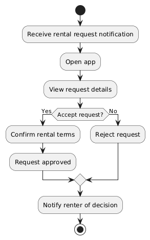
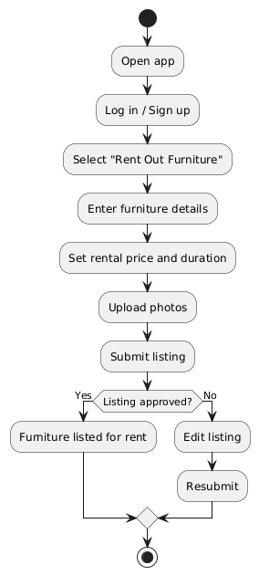

# Specification Phase Exercise

A little exercise to get started with the specification phase of the software development lifecycle. See the [instructions](instructions.md) for more detail.

## Team members

[Mikhail Bond](https://github.com/mikhailbond1), [Albert Chen](https://github.com/azc9673), [Chenyu Jiang](https://github.com/ginny1536), [Suri Su](https://github.com/suri-zip), [Tim Xu](https://github.com/TimXu2006)

## Stakeholders

### Renters: 
During the interview, a candidate of the "renters" demographic of the app talked about his desire to make use of his unused furniture, earn extra side money, and decrease furniture waste. See the full list of his goals/frustrations below:

**Goals / Needs:**
- Make use of furniture that would otherwise sit unused while traveling or studying abroa
- Decrease waste of unused items
- Earn extra income by renting furniture to other students
- Make use of furniture items during break times such as winter or summer break

**Problems / Frustrations:**
- Furniture remains unused for months when they are away from school
- Limited income and financial pressure as college students
- No easy way to safely lend other students furniture in the short term 
- Limited space in apartment makes storing unused furniture inconvenient

## Product Vision Statement

See instructions. Delete this line and place your Product Vision Statement here.

## User Requirements

### Renters: 
- As a renter, I want to reduce clutter so that my living space feels more comfortable.
- As a renter, I want to sell or share unused furniture so that it doesn’t go to waste.
- As a renter, I want to earn extra income from unused items so that I can cover monthly expenses.
- As a renter, I want to easily remove furniture I no longer need so that moving is less stressful.
- As a renter, I want to repurpose unused furniture so that I live more sustainably.
- As a renter, I want a simple way to list unused items so that others can benefit from them.
- As a renter, I want to downsize my belongings so that my apartment is easier to maintain.
- As a renter, I want to give away furniture I don’t use so that someone else can make use of it.
- As a renter, I want to free up storage space so that my apartment feels more organized.
- As a renter, I want to avoid throwing away usable furniture so that I reduce environmental impact.

## Activity Diagrams
**Recieve Rental Request**

**List Furniture Item**

## Clickable Prototype

See instructions. Delete this line and place a publicly-accessible link to your clickable prototype here.
