# Specification Phase Exercise

A little exercise to get started with the specification phase of the software development lifecycle. See the [instructions](instructions.md) for more detail.

## Team members

[Mikhail Bond](https://github.com/mikhailbond1), [Albert Chen](https://github.com/azc9673), [Chenyu Jiang](https://github.com/ginny1536), [Suri Su](https://github.com/suri-zip), [Tim Xu](https://github.com/TimXu2006)

## Stakeholders

### Rentees:
Interview Subject: A student who has their own production company and often rents out their gears to other people. See the full list of their goals/fristrations below:

**Goals / Needs:**
1. They want easy to access on their phone to their rental page and messages, so they can see rental requests as soon as possible and talk to their renters more conveniently.
2. They want insurance and agreements that protect their rights and the safety of their belongings
3. Space and opportunities to advertise their belongings so more people can see them and rent from them.
4. Need to be able to rate the people who rented from them in terms of whether they are on time for pickup and drop of and how well they take care of the equipment.

**Problems / Frustrations:**
1. On an existing film equipment rental website, rentees need to change the availability of every piece of equipment listed individually if they are out of town or don’t want to receive any rental requests. A status update on their profile saying they are out of town or pausing all rental requests would be helpful, so no user can rent from them when they are in that status.
2. Don’t know who they are renting to on online rental websites. Thus, very hard to trust people who rent from them to be responsible and will take care of their objects.
3. Renters are not responsive, causing difficulties for scheduling pick up and drop off times, and locking in the dates of rentals.
4. Not a clear or logical label system where the owner doesn’t know how to label their listings, so renters can find them easily.

During the interview, a candidate of the "renters" demographic of the app talked about his desire to make use of his unused furniture, earn extra side money, and decrease furniture waste. See the full list of his goals/frustrations below:

**Goals / Needs:**
1. Make use of furniture that would otherwise sit unused while traveling or studying abroad
2. Decrease waste of unused items
3. Earn extra income by renting furniture to other students
4. Make use of furniture items during break times such as winter or summer break

**Problems / Frustrations:**
1. Furniture remains unused for months when they are away from school
2. Limited income and financial pressure as college students
3. No easy way to safely lend other students furniture in the short term 
4. Limited space in apartment makes storing unused furniture inconvenient

### Renters: 
Interview Subject: An international student who is a senior in college and is currently looking for new furniture for their last year living around campus. See the full list of their goals and frustration below.

**Goals / Needs:**
1. They need furniture that they only need for a period of time.
2. They want to see ratings for the furniture owner so they have a standard to decide whether to rent from them or not.
3. They need to see the furniture owner's location so they can decide if they can pick it up or ship it to them.
4. They want to see detailed photos of the furniture they are renting in order to insure that it is good to use.

**Problems / Frustration**
1. Buying new furniture is too expensive for only using it for a year.
2. The current existing softwares are all open to everyone in the area, thus there are a lot of not trustworthy people to rent from.
3. Many furniture owners don't reply or reply very slowly, causing inconvinience to scheduling pickup and drop off.
4. Many existing platforms charge a large amount of extra fees for every transaction as a platform fee.

### Admins:
Interview subject: A student who is experienced in buying and selling ACG goods and products on a second-hand platform. She addresses some needs and worries that an admin of such platform may have. 

**Goals / Needs:**
1. Maintain the platform's security and order, make sure there are no scams, counterfeit goods, or prohibited content.
2. Promptly address reports and disputes, provent users from feeling neglected.
3. Manage product categories and content quality. Prevent items like “sofas” from appearing in “electronics” listings.
4. Verify new and suspicious account. Monitor unusually active accounts and duplicate postings.

**Problems / Frustrations**
1. Too many reports but no prioritization system. The admin cannot keep up with every single one.
2. Hard to tell who's lying. Buyers claim they are scammed, and sellers say they are unreasonable.
3. Unclear platform rules leading to a lack of basis when handling disputes.
4. Too many manual labor when deleting and banning.

### Buyers:
An international student at NYU was interviewed about their experience purchasing secondhand furniture while living off campus. See the full list of their goals/fristrations below:

**Goals / Needs:**
1. Find furniture at a significantly lower price than new items
2. Make sure that items are up to quality and in good condition before buying
3. Opportunities to discover furniture with unique aesthetic/style that cannot be found in typical stores
4. Reduce waste by reusing furniture

**Problems / Frustrations**
1. Difficulty finding specific styles/sizes/colors that match their needs
2. Challenges in transporting bulky items, especially as a student without a car in NYC
3. Lack of warranty if the furniture doesn't meet expectations or breaks quickly
4. Worry about hidden damages that sellers would potentially cover up for a better price

## Product Vision Statement

A peer-to-peer marketplace where college students can buy, sell, rent, and lent second-hand furniture from one another, creating a safe environment for affordable, eco-friendly furnishings.

## User Requirements

### Renters: 
- As a renter, I want to see detailed listings with accurate labels and multiple photos, so that I know exactly what I am renting and have fewer complaints or questions for the rentee.
- As a renter, I want a built-in message system that keeps track of all the history of unsent and edited message functions, so that I can document all verbal agreements and communications in one place to protect myself from fraud.
- As a renter, I want to see detailed information about the person renting to me, so that I can make an informed decision about their reliability.
- As a renter, I want to rent only when both the item is available and when the owner is available, so that I don’t need to cancel my booking due to the furniture’s unavailability.
- As a renter, I want to filter by catogory, price range, and location when I am searching up a furniture, so that it is easier for me to find my desired furniture.
- As a renter, I want to save listings on a wishlist, so that I can compare listings or come back to them later.
- As a renter, I want to recieve notifications for new listings in a category I follow, so that I can request rentals as soon as possible if it fits my liking.
- As a renter, I want to be able to extend my rental periods, so that I can keep the furniture longer if my plans change.
- As a renter, I want to report any damage or maintainance issue, so that I can fix problems immediately and document them.
- As a renter, I want to be able to end my rental period earlier, so that I can get a refund for the days I don't need it anymore if my plans change.

### Buyers:
- As a buyer, I want to filter furniture by size, color, style, etc., so that I can quickly find pieces that fit myself.
- As a buyer, I want to see clear photos from multiple angles so that I can check the condition before I decide to buy.
- As a buyer, I want sellers to honestly list any stains, or damage upfront so that I’m not surprised after I get the furniture.
- As a buyer, I want to read reviews from other buyers about a seller so that I feel confident that I’m buying from someone trustworthy.
- As a buyer, I want to compare prices with similar items as well as the price of a new item of the same model, so that I know I’m getting a good deal.
- As a buyer, I want to save or bookmark items I like so that I can come back to them later and compare options.
- As a buyer, I want the option to arrange delivery or pickup help so that I can get bulky furniture without needing a car.
- As a buyer, I want to message sellers easily before buying so that I can ask questions about condition, measurements, etc.
- As a buyer, I want a short return period so that I don't lose anything if the item isn’t as described or breaks right away.
- As a buyer, I want to see how buying second-hand helps reduce waste so that I feel good about making an eco-friendly choice.

### Rentees:
- As a rentee, I want to create detailed listings with accurate labels and multiple photos, so that renters can know exactly what they are renting and have fewer complaints or questions for me.
- As a rentee, I want to set my rental prices and available dates for each of my listings, so that I have control over my own listings’ availability and achieve the income I want.
- As a rentee, I want to set my rental status on my profile, so that I can click only one button to stop receiving all rental requests until I open the status back up.
- As a rentee, I want to rate renters who have rented from me, so that I can inform the other rentees whether they should rent to this renter or not in the future.
- As a rentee, I want to see the ratings of the renters who sent my rental requests, so that I can use them as a standard to decide whether or not to accept them.
- As a rentee, I want to see detailed information about the person renting from me, so that I know who is renting from me and can make an informed decision about their reliability.
- As a rentee, I want to receive immediate notifications of receiving a rental request, so that I can reply to the request quickly and conveniently, and not miss any rental opportunities. 
- As a rentee, I want to set a general pickup location on my profile, so that people don’t cancel rental requests because they found out the location is too far after booking it, while protecting my privacy regarding the exact location of my home.
- As a rentee, I want to pay money for promoting my listings, so that I can let more people see my listings and have more rental requests.
- As a rentee, I want to set my own terms of delivery and pickup policies and post them along with the listings, so that renters know exactly how to receive the item they rented, and it suits my convenience as an owner.
- As a rentee, I want to reduce clutter so that my living space feels more comfortable.
- As a rentee, I want to sell or share unused furniture so that it doesn’t go to waste.
- As a rentee, I want to earn extra income from unused items so that I can cover monthly expenses.
- As a rentee, I want to easily remove furniture I no longer need so that moving is less stressful.
- As a rentee, I want to repurpose unused furniture so that I live more sustainably.
- As a rentee, I want a simple way to list unused items so that others can benefit from them.
- As a rentee, I want to downsize my belongings so that my apartment is easier to maintain.
- As a rentee, I want to give away furniture I don’t use so that someone else can make use of it.
- As a rentee, I want to free up storage space so that my apartment feels more organized.
- As a rentee, I want to avoid throwing away usable furniture so that I reduce environmental impact.

### Sellers:
- As a seller, I want to verify that buyers are NYU students so that I feel safe selling to them.
- As a seller, I want to create a listing with photos, price, and condition so that buyers clearly understand what I’m selling.
- As a seller, I want the app to suggest a fair price based on similar NYU listings so that I can sell faster without guessing.
- As a seller, I want to set a deadline for when the item must be gone so that buyers understand urgency.
- As a seller, I want to specify pickup or delivery options so that logistics are clear upfront.
- As a seller, I want to communicate with buyers through in-app messaging so that I don’t have to switch between different apps or share my phone number.
- As a seller, I want to receive and confirm payment within the same app so that buyers and sellers from different countries don’t struggle with incompatible payment platforms.
- As a seller, I want to schedule pickup time windows in the app so that coordinating across time zones and schedules is simple.
- As a seller, I want to mark an item as pending or sold so that I stop receiving unnecessary messages.
- As a seller, I want clear payment status (paid / unpaid / pending) so that there is no confusion at pickup time.

### Admin:
- As an admin, I want to review reported listings so that I can remove inappropriate or fraudulent content.
- As an admin, I want to suspend or ban users who violate platform rules so that I can maintain a safe trading environment.
- As an admin, I want to view a user's posting history so that I can identify suspicious behavior patterns.
- As an admin, I want to verify student email addresses so that only university members can access the platform.
- As an admin, I want to review transaction disputes so that I can fairly resolve conflicts between buyers and sellers.
- As an admin, I want to access chat logs between users (if reported) so that I can investigate potential scams.
- As an admin, I want to approve or reject new listings before they become visible so that low-quality content does not spread.
- As an admin, I want to see statistics on reported listings and banned accounts so that I can monitor platform health.
- As an admin, I want to identify users who post multiple listings in a short time so that I can detect spam behavior.
- As an admin, I want to edit or update platform rules so that policies remain clear and enforceable.

## Activity Diagrams

### Renters
**As a renter, I want to rent only when both the item is available and when the owner is available, so that I don’t need to cancel my booking due to the furniture’s unavailability.**
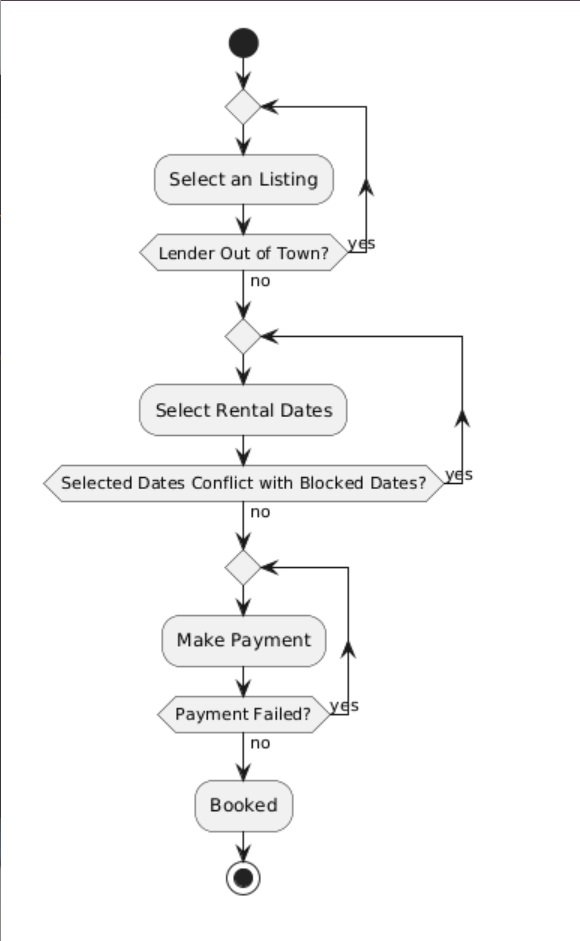

**As a renter, I want to be able to end my rental period earlier, so that I can get a refund for the days I don't need it anymore if my plans change.**
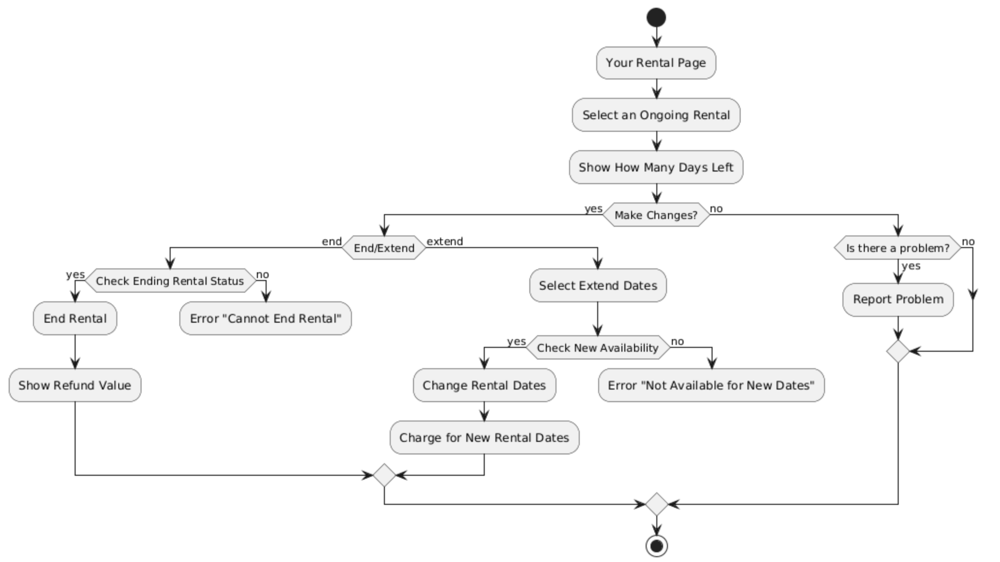

### Buyers
**View and Select Listings**
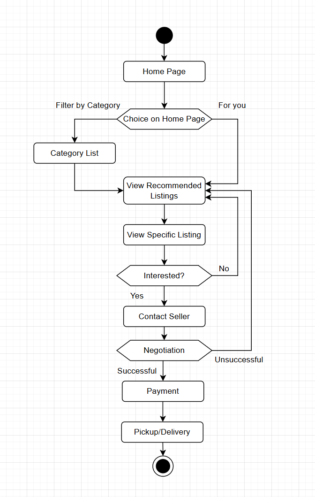

**Refund/Issue with Item Quality**
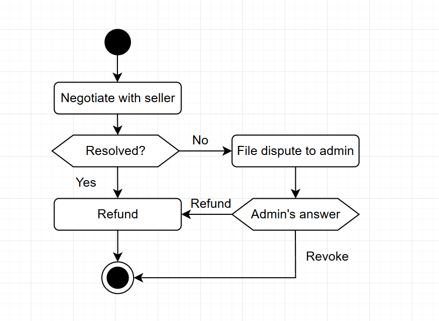

### Rentees
**As a rentee, I want to create detailed listings with accurate labels and multiple photos, so that renters can know exactly what they are renting and have fewer complaints or questions for me.**
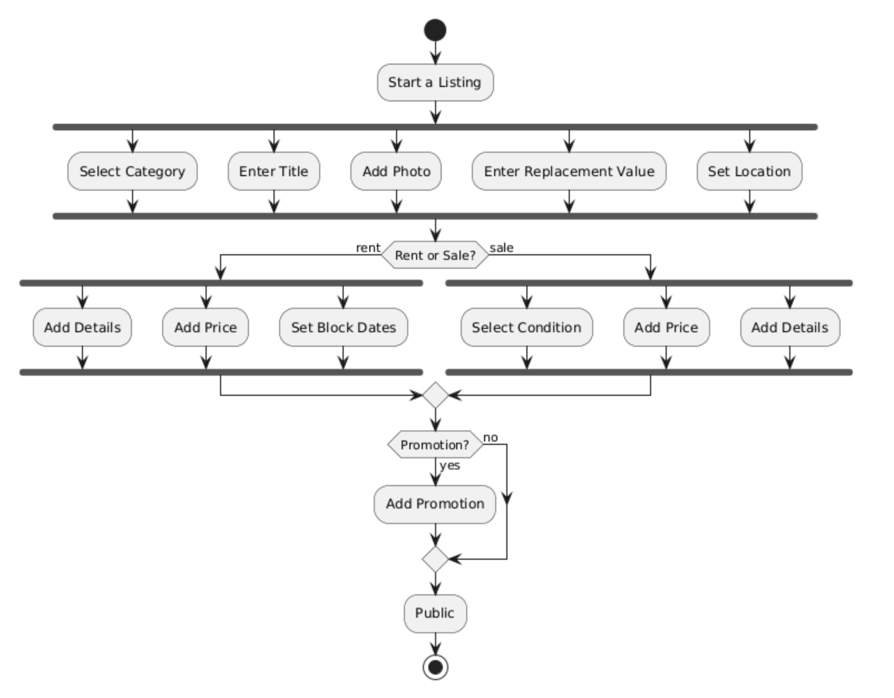

**Manage Listing Requests**
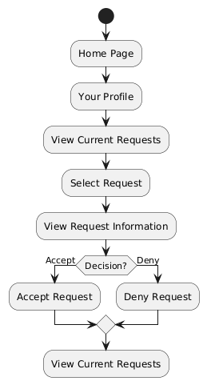

**View Your Listings**
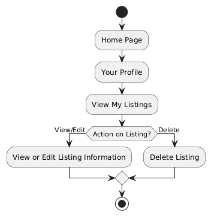

### Sellers
**Create Listing**
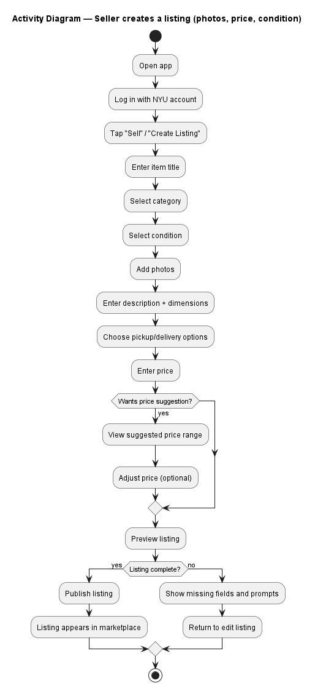

**View and Confirm Payment**
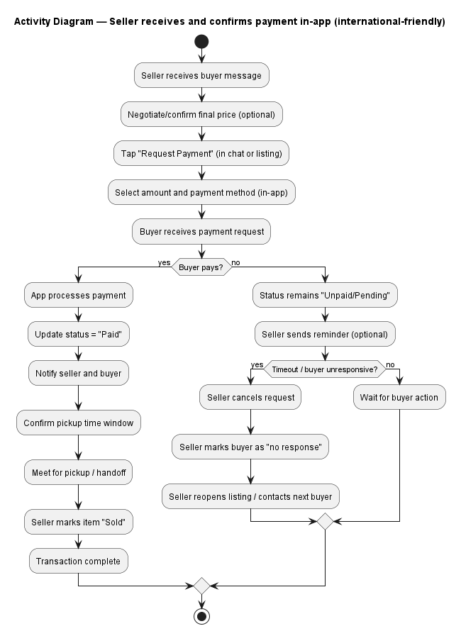

### Admin
**Resolve Disputes**
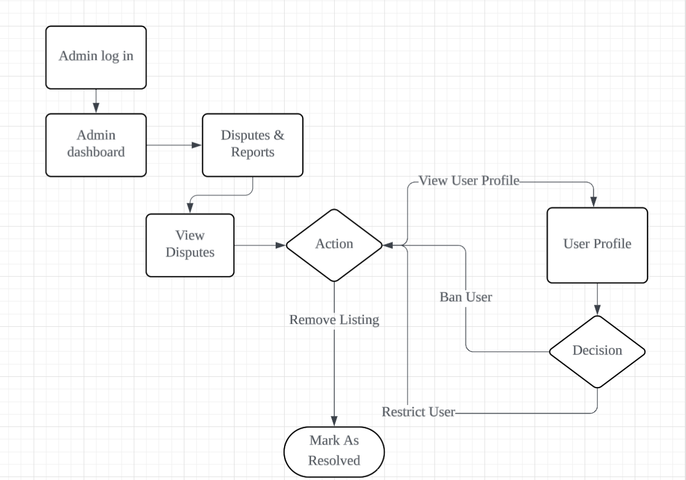

**Verify User**
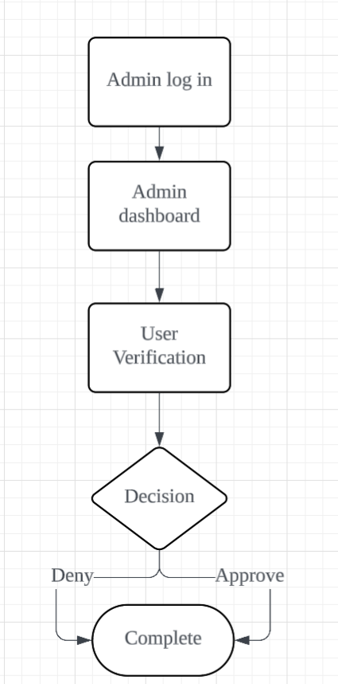

## Clickable Prototype

Click [here](https://www.figma.com/design/tinB5jIVPK3t07VVoDa5xX/turtle_Wireframe?node-id=0-1&t=wJV6R6hu07N2L0vz-1) for the clickable prototype.

Click [here](https://www.figma.com/board/uiMbACvNZ26yQVaQhiYjSI/turtle_AppMap?t=wJV6R6hu07N2L0vz-1) for the app map.

Click [here](https://www.figma.com/files/team/1075815332585348015/project/549678064/Turtles?fuid=1595655509916578368) for our prototype folder on Figma.

